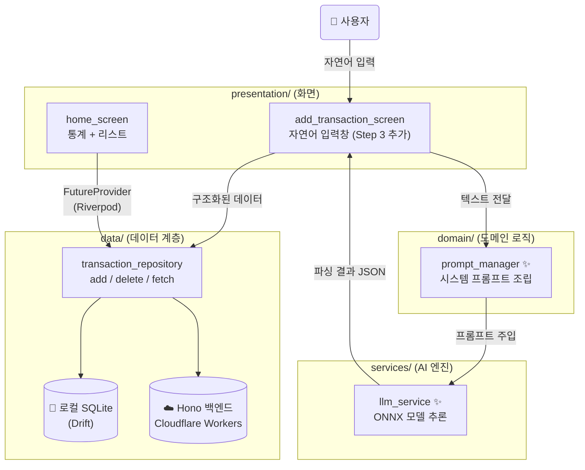

# Flutter 프론트엔드 아키텍처 (Step 3 완성 기준)

## 계층 구조 개요

```
apps/mobile/lib/
├── main.dart                        # 앱 진입점 · Supabase 초기화 · AuthGate 라우팅
│
├── core/                            # 〔공통 유틸리티 & 설정〕
│   ├── constants/
│   │   └── categories.dart          # 고정 카테고리 목록 (식비, 교통 등)
│   └── network/
│       └── dio_client.dart          # Dio HTTP 클라이언트 & JWT 자동 주입 Interceptor
│
├── data/                            # 〔데이터 계층 - 외부 세계와 앱 사이의 다리〕
│   ├── local/
│   │   ├── tables/
│   │   │   └── transactions_table.dart    # Drift 테이블 정의 (Transactions, SyncQueue)
│   │   ├── database.dart                  # AppDatabase · NativeDatabase 초기화
│   │   └── database.g.dart               # Drift 코드 제너레이터 자동 생성 파일 (수동 수정 금지)
│   ├── remote/
│   │   └── (확장 예정: 직접 API 응답 DTO 모델)
│   └── repositories/
│       └── transaction_repository.dart   # fetchSummary / fetchTransactions / add / delete 통합
│
├── domain/                          # 〔비즈니스 도메인 로직 - 앱의 본질적인 규칙〕
│   ├── models/
│   │   └── (확장 예정: 순수 Dart 데이터 클래스)
│   └── agent/                       # ✨ NEW (Step 3)
│       └── prompt_manager.dart      # LLM 시스템 프롬프트 & Few-shot 템플릿 관리자
│
├── services/                        # 〔외부 SDK / ML 런타임 추상화 계층〕
│   └── llm_service.dart             # ✨ NEW (Step 3) ONNX 세션 열기 · 추론 실행 · 결과 디코딩
│
└── presentation/                    # 〔UI 화면 - 사용자 눈에 보이는 영역〕
    ├── auth/
    │   └── login_screen.dart        # 이메일 OTP 방식 Supabase 로그인 화면
    ├── home/
    │   ├── home_screen.dart         # 월별 통계 카드 + 지출 목록 리스트 + 스와이프 삭제
    │   └── widgets/                 # (확장 예정: 분리된 위젯)
    ├── transaction/
    │   ├── add_transaction_screen.dart  # 수기 입력 폼 + ✨ NEW 자연어 채팅 AI 입력창 (Step 3)
    │   └── widgets/                 # (확장 예정: 분리된 위젯)
    └── agent/                       # ✨ NEW (Step 3)
        └── (확장 예정: 에이전트 전용 채팅 뷰)
```

## 데이터 흐름 다이어그램



## 계층별 핵심 책임

| 계층 | 폴더 | 책임 |
|------|------|------|
| **UI** | `presentation/` | 사용자에게 보여줄 화면과 위젯 |
| **AI 서비스** | `services/` | ONNX 세션·추론·디코딩 등 외부 SDK 캡슐화 |
| **도메인** | `domain/` | 프롬프트 설계, 데이터 모델 정의 등 비즈니스 규칙 |
| **데이터** | `data/` | 로컬 SQLite(Drift), 원격 Hono API(Dio) 통합 |
| **공통** | `core/` | 모든 계층에서 공유되는 설정·상수·네트워크 클라이언트 |
