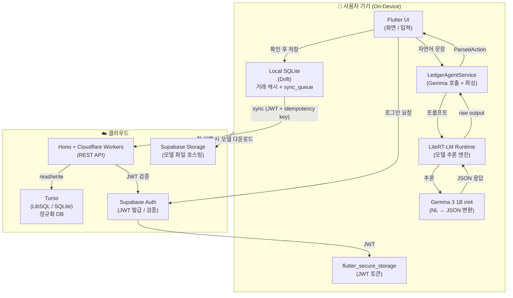
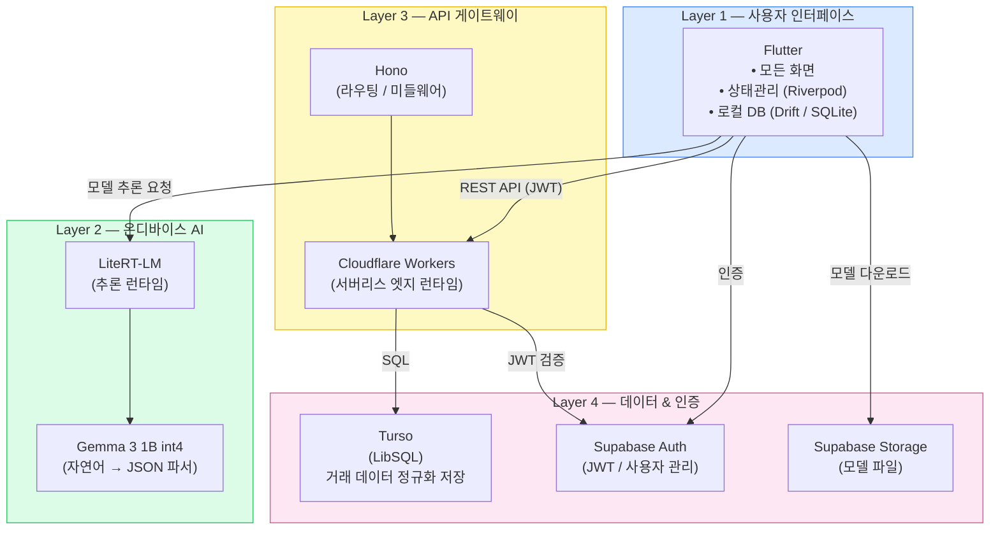
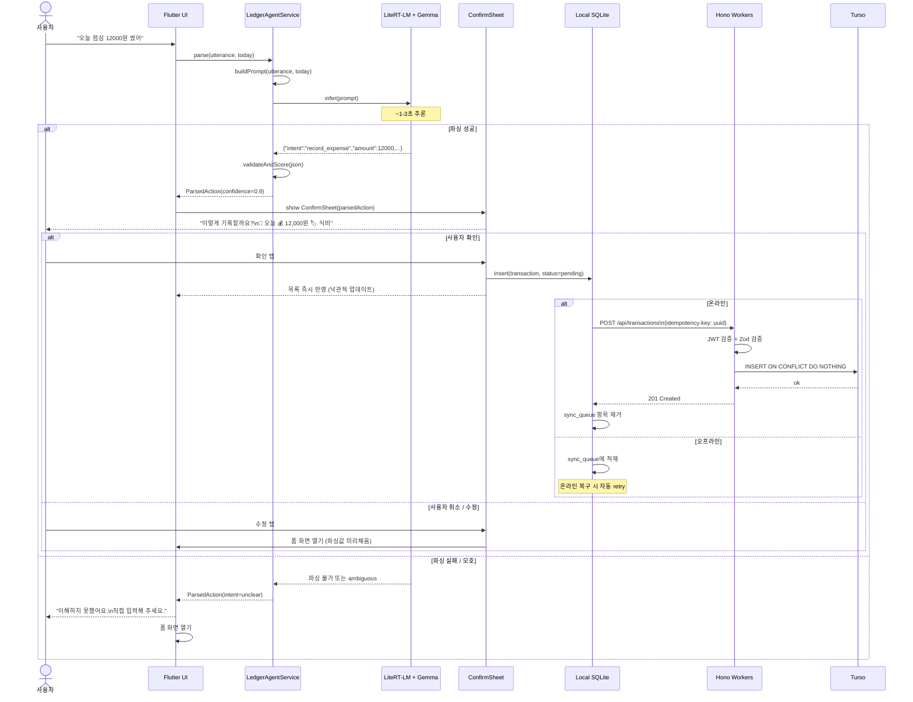
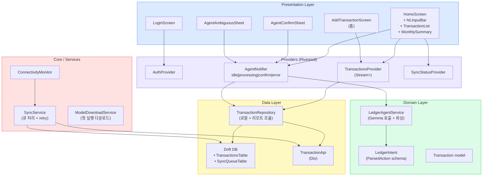
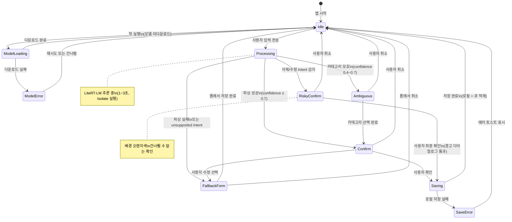
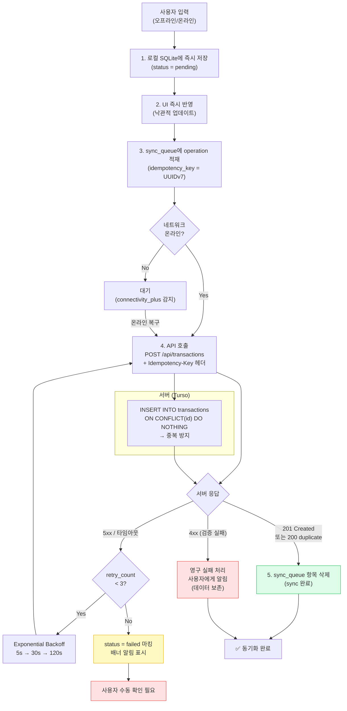
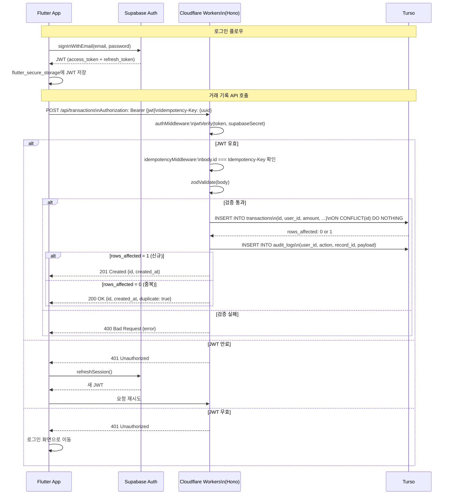
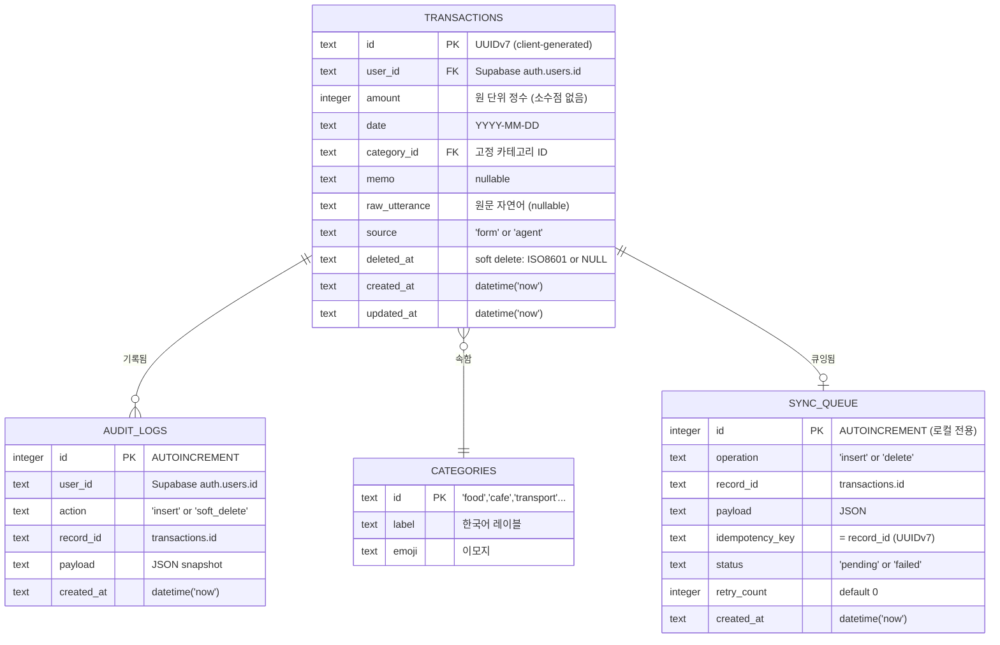
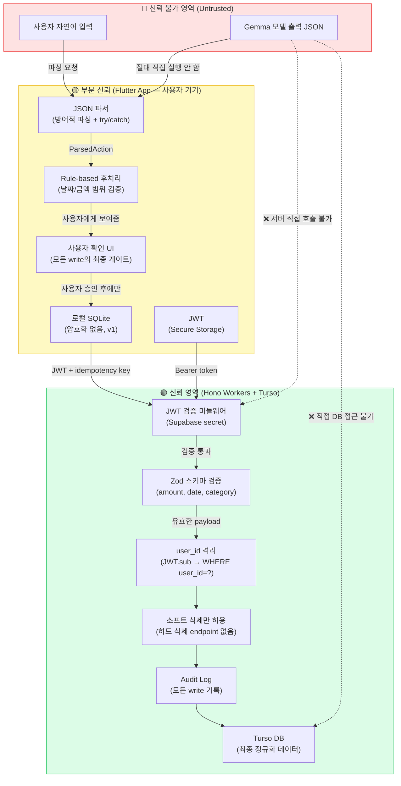
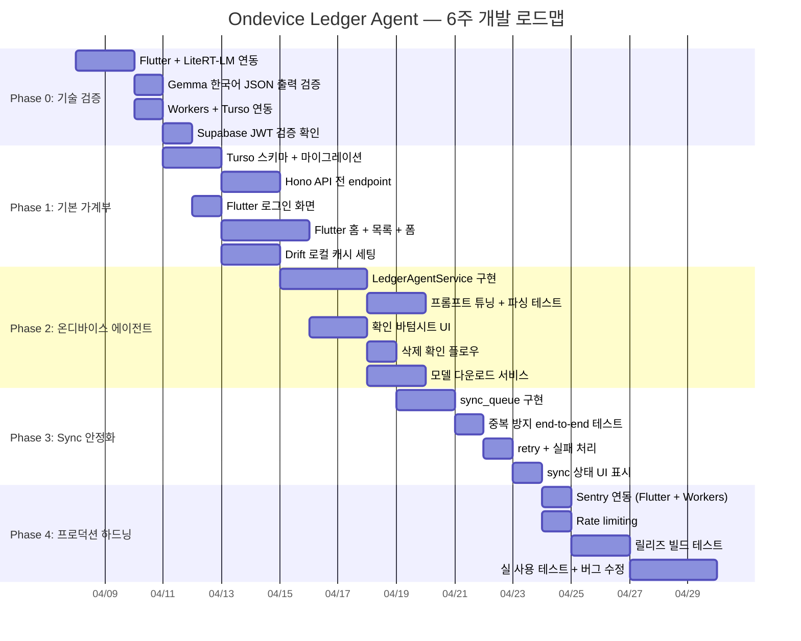

# Ondevice Ledger Agent — Architecture Diagrams

> 전체 시스템 아키텍처 다이어그램 모음

---

## 목차

1. [전체 시스템 아키텍처](#1-전체-시스템-아키텍처)
2. [기술 스택 레이어](#2-기술-스택-레이어)
3. [자연어 입력 플로우](#3-자연어-입력-플로우)
4. [Flutter 앱 내부 구조](#4-flutter-앱-내부-구조)
5. [온디바이스 에이전트 상태 머신](#5-온디바이스-에이전트-상태-머신)
6. [오프라인 Sync 플로우](#6-오프라인-sync-플로우)
7. [API 요청 흐름 (인증 포함)](#7-api-요청-흐름-인증-포함)
8. [DB 스키마 (ER 다이어그램)](#8-db-스키마-er-다이어그램)
9. [신뢰 경계 (Trust Boundary)](#9-신뢰-경계-trust-boundary)
10. [개발 단계별 로드맵](#10-개발-단계별-로드맵)

---

## 1. 전체 시스템 아키텍처

---

## 2. 기술 스택 레이어

---

## 3. 자연어 입력 플로우

---

## 4. Flutter 앱 내부 구조

---

## 5. 온디바이스 에이전트 상태 머신

---

## 6. 오프라인 Sync 플로우

---

## 7. API 요청 흐름 (인증 포함)

---

## 8. DB 스키마 (ER 다이어그램)

---

## 9. 신뢰 경계 (Trust Boundary)

---

## 10. 개발 단계별 로드맵

---

## 다이어그램 범례

| 색상 | 의미 |
|------|------|
| 🔵 파란색 | Flutter / UI 레이어 |
| 🟢 초록색 | 온디바이스 AI (Gemma / LiteRT-LM) |
| 🟡 노란색 | API 레이어 (Hono / Workers) |
| 🩷 분홍색 | 데이터 / 인증 레이어 (Turso / Supabase) |
| 🔴 빨간색 | 신뢰 불가 / 위험 영역 |
| 🟢 초록 테두리 | 신뢰 가능 / 안전한 영역 |

> 이 다이어그램들은 [Mermaid](https://mermaid.js.org/)로 작성되어 GitHub에서 자동으로 렌더링됩니다.
