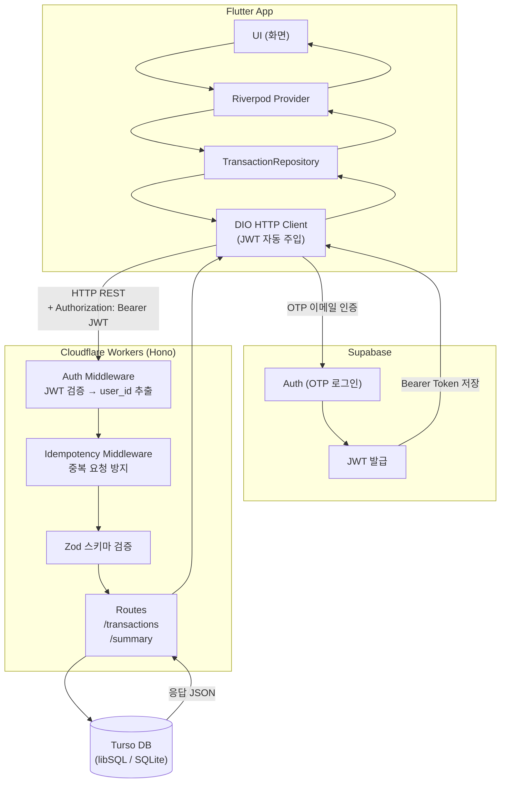
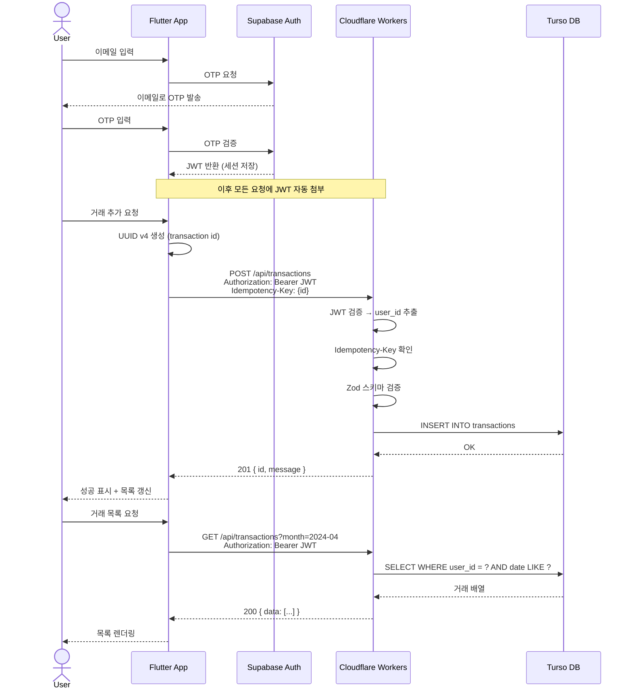
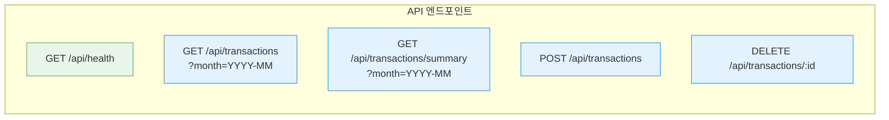

# API 통신 명세

프론트엔드(Flutter)와 백엔드(Cloudflare Workers/Hono) 간의 통신 구조와 데이터 형식을 정리합니다.

---

## 전체 흐름

### 시스템 구성도



### 요청 처리 순서 (시퀀스)



### 엔드포인트 한눈에 보기



- 초록: 인증 불필요 / 파랑: `Authorization: Bearer JWT` 필수

WebSocket/SSE는 사용하지 않으며, 모든 통신은 **HTTP REST**로만 이루어집니다.

---

## 공통 헤더

모든 보호된 엔드포인트에 필요한 헤더:

```
Authorization: Bearer <JWT_TOKEN>
Content-Type: application/json
```

JWT는 `Supabase.instance.client.auth.currentSession.accessToken`에서 자동 주입됩니다.
(`apps/mobile/lib/core/network/dio_client.dart` 인터셉터 처리)

---

## 엔드포인트 목록

### `GET /api/health`

헬스체크 용도.

**Response**
```json
{ "status": "ok", "timestamp": "2024-04-08T00:00:00.000Z" }
```

---

### `POST /api/transactions` — 거래 생성

**추가 헤더**
```
Idempotency-Key: <transaction-id>   ← request body의 id 와 동일해야 함
```

**Request Body**
```json
{
  "id": "550e8400-e29b-41d4-a716-446655440000",  // UUID v4, 클라이언트가 생성
  "amount": 5000,                                  // 양의 정수, 최대 100,000,000 (원)
  "date": "2024-04-08",                            // YYYY-MM-DD
  "category_id": "food",                           // 아래 카테고리 enum 참고
  "memo": "점심 식사",                              // optional, 최대 200자
  "raw_utterance": "오늘 점심 5천원",               // optional, 최대 500자 (에이전트 입력 원문)
  "source": "form"                                 // "form" | "agent"
}
```

**카테고리 enum**
| 값 | 설명 |
|----|------|
| `food` | 식사 |
| `cafe` | 카페 |
| `transport` | 교통 |
| `shopping` | 쇼핑 |
| `health` | 건강 |
| `culture` | 문화 |
| `utility` | 공과금 |
| `etc` | 기타 |

**Response — 정상 생성 (HTTP 201)**
```json
{ "id": "550e8400-...", "message": "Transaction created" }
```

**Response — 중복 요청 (HTTP 200)**
```json
{ "id": "550e8400-...", "duplicate": true }
```

**Response — 오류 (HTTP 400 / 500)**
```json
{ "error": "설명 문자열", "details": {} }
```

---

### `GET /api/transactions` — 거래 목록 조회

**Query Parameters**
| 파라미터 | 필수 | 형식 | 설명 |
|---------|-----|------|------|
| `month` | 선택 | `YYYY-MM` | 해당 월 필터링. 생략 시 전체 |

**Response (HTTP 200)**
```json
{
  "data": [
    {
      "id": "550e8400-e29b-41d4-a716-446655440000",
      "user_id": "supabase-user-uuid",
      "amount": 5000,
      "date": "2024-04-08",
      "category_id": "food",
      "memo": "점심 식사",
      "raw_utterance": null,
      "source": "form",
      "deleted_at": null,
      "created_at": "2024-04-08T12:00:00",
      "updated_at": "2024-04-08T12:00:00"
    }
  ]
}
```

> `deleted_at`이 non-null인 항목은 소프트 삭제된 항목으로, 백엔드에서 이미 필터링됩니다.

---

### `GET /api/transactions/summary` — 월별 요약 조회

**Query Parameters**
| 파라미터 | 필수 | 형식 | 설명 |
|---------|-----|------|------|
| `month` | 필수 | `YYYY-MM` | 요약할 월 |

**Response (HTTP 200)**
```json
{
  "month": "2024-04",
  "total": 150000,
  "by_category": [
    { "category_id": "food", "amount": 80000, "count": 8 },
    { "category_id": "transport", "amount": 70000, "count": 5 }
  ]
}
```

---

### `DELETE /api/transactions/:id` — 거래 삭제 (소프트 삭제)

**URL Parameters**
| 파라미터 | 설명 |
|---------|------|
| `id` | 삭제할 거래의 UUID |

**Response — 성공 (HTTP 200)**
```json
{ "message": "Transaction deleted" }
```

**Response — 없는 ID (HTTP 404)**
```json
{ "error": "Transaction not found" }
```

---

## 타입 대응표

| 필드 | 백엔드 (TypeScript/Zod) | 프론트엔드 (Dart) | DB (SQLite) |
|------|------------------------|-------------------|-------------|
| `id` | `string` (UUID) | `String` | `TEXT` |
| `amount` | `number` (양의 정수) | `int` | `INTEGER` |
| `date` | `string` (YYYY-MM-DD) | `String` | `TEXT` |
| `category_id` | `z.enum([...])` | `String` | `TEXT` |
| `memo` | `string \| undefined` | `String?` | `TEXT NULL` |
| `raw_utterance` | `string \| undefined` | `String?` | `TEXT NULL` |
| `source` | `"form" \| "agent"` | `String` | `TEXT` |
| `created_at` | ISO8601 string | `DateTime` | `TEXT` |
| `deleted_at` | ISO8601 string \| null | `DateTime?` | `TEXT NULL` |

> `amount`는 원화 기준 정수만 사용합니다. 부동소수점을 쓰지 않는 이유는 정밀도 오차 방지입니다.

---

## 오류 코드 정리

| HTTP 상태 | 원인 |
|----------|------|
| `400` | 스키마 검증 실패, `Idempotency-Key` 누락/불일치, 필수 파라미터 누락 |
| `401` | JWT 없음 또는 만료 |
| `404` | 삭제 요청 시 해당 ID 없음 |
| `500` | DB 오류 등 서버 내부 오류 |

---

## 프론트엔드 코드 위치

| 역할 | 파일 |
|------|------|
| DIO 클라이언트 (토큰 주입) | `apps/mobile/lib/core/network/dio_client.dart` |
| API 호출 Repository | `apps/mobile/lib/data/repositories/transaction_repository.dart` |
| 상태 관리 Provider | `apps/mobile/lib/presentation/home/home_screen.dart` |
| 거래 추가 화면 | `apps/mobile/lib/presentation/transaction/add_transaction_screen.dart` |

## 백엔드 코드 위치

| 역할 | 파일 |
|------|------|
| 라우터 진입점 | `apps/api/src/index.ts` |
| 거래 라우트 | `apps/api/src/routes/transactions.ts` |
| 요약 라우트 | `apps/api/src/routes/summary.ts` |
| Auth 미들웨어 | `apps/api/src/middleware/auth.ts` |
| Idempotency 미들웨어 | `apps/api/src/middleware/idempotency.ts` |
| Zod 스키마 | `apps/api/src/validators/transaction.ts` |
| DB 마이그레이션 | `apps/api/migrations/001_initial.sql` |
