# Ondevice Ledger Agent — Architecture Diagrams

> 전체 시스템 아키텍처 다이어그램 모음

---

## 목차

1. [전체 시스템 아키텍처](#1-전체-시스템-아키텍처)
2. [기술 스택 레이어](#2-기술-스택-레이어)
3. [자연어 입력 플로우](#3-자연어-입력-플로우)
4. [Flutter 앱 내부 구조](#4-flutter-앱-내부-구조)
5. [온디바이스 에이전트 상태 머신](#5-온디바이스-에이전트-상태-머신)
6. [오프라인 Sync 플로우](#6-오프라인-sync-플로우)
7. [API 요청 흐름 (인증 포함)](#7-api-요청-흐름-인증-포함)
8. [DB 스키마 (ER 다이어그램)](#8-db-스키마-er-다이어그램)
9. [신뢰 경계 (Trust Boundary)](#9-신뢰-경계-trust-boundary)
10. [개발 단계별 로드맵](#10-개발-단계별-로드맵)
11. [모노레포 전체 파일 트리](#11-모노레포-전체-파일-트리)
12. [Flutter 파일 의존성 그래프](#12-flutter-파일-의존성-그래프)
13. [Flutter 파일별 역할 일람](#13-flutter-파일별-역할-일람)
14. [Hono API 파일 의존성 그래프](#14-hono-api-파일-의존성-그래프)
15. [API 파일별 역할 일람](#15-api-파일별-역할-일람)
16. [마이그레이션 파일 적용 순서](#16-마이그레이션-파일-적용-순서)

---

## 1. 전체 시스템 아키텍처

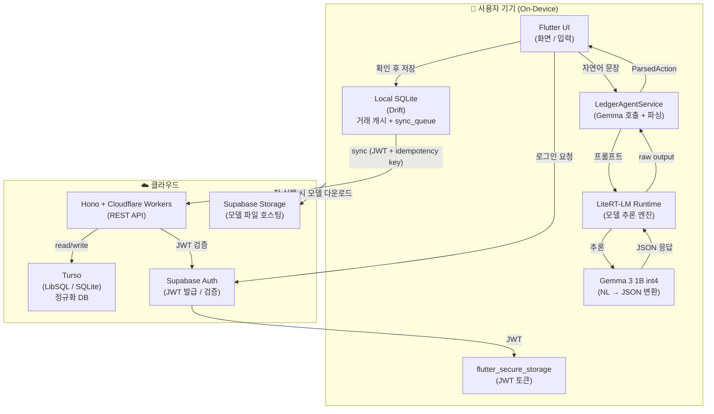

---

## 2. 기술 스택 레이어

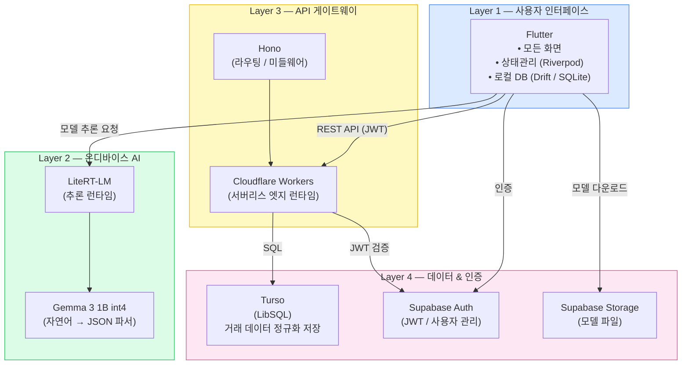

---

## 3. 자연어 입력 플로우

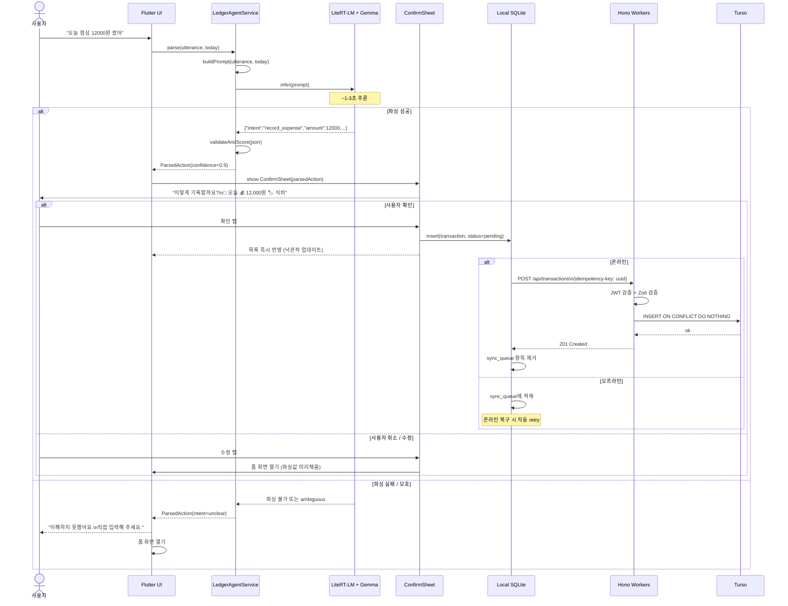

---

## 4. Flutter 앱 내부 구조

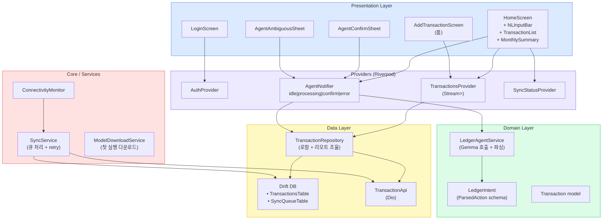

---

## 5. 온디바이스 에이전트 상태 머신

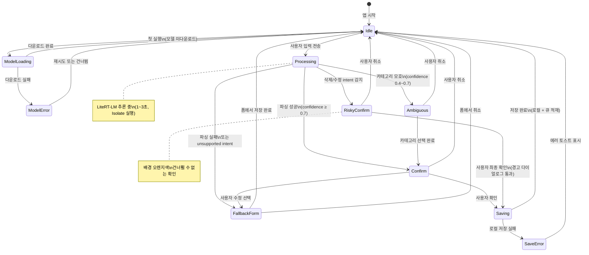

---

## 6. 오프라인 Sync 플로우

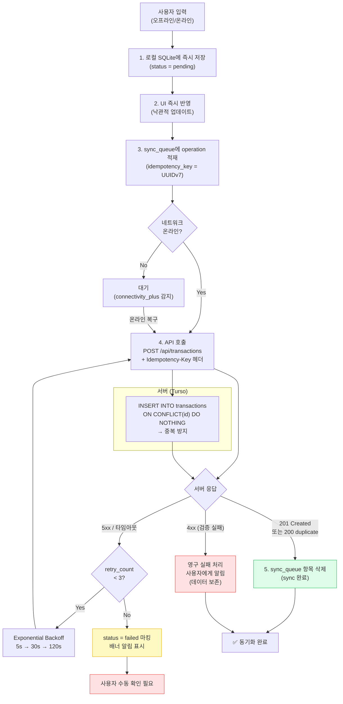

---

## 7. API 요청 흐름 (인증 포함)

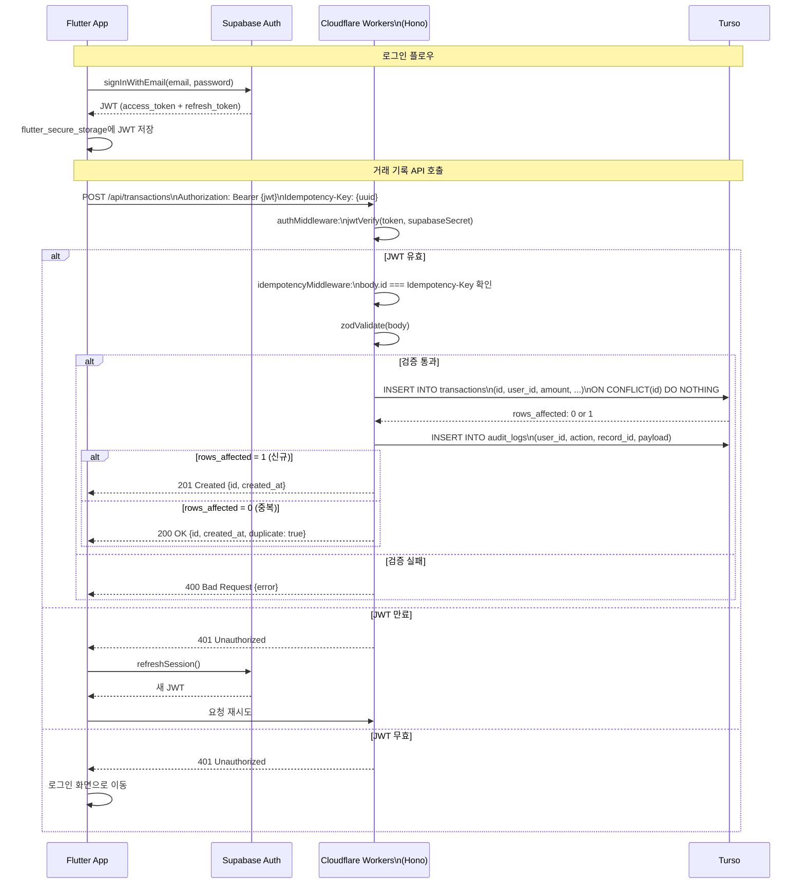

---

## 8. DB 스키마 (ER 다이어그램)

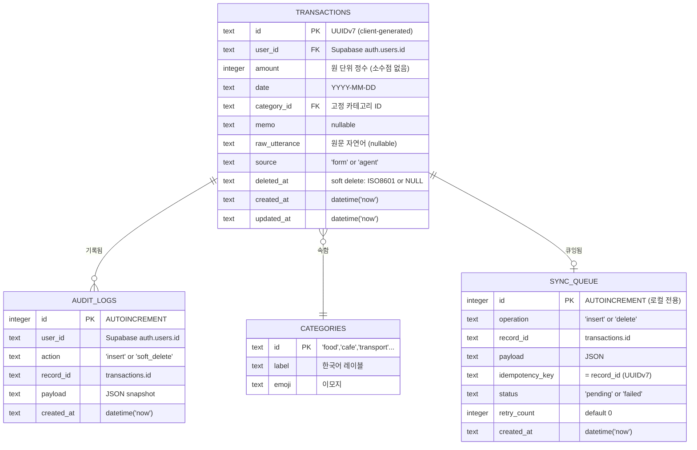

---

## 9. 신뢰 경계 (Trust Boundary)

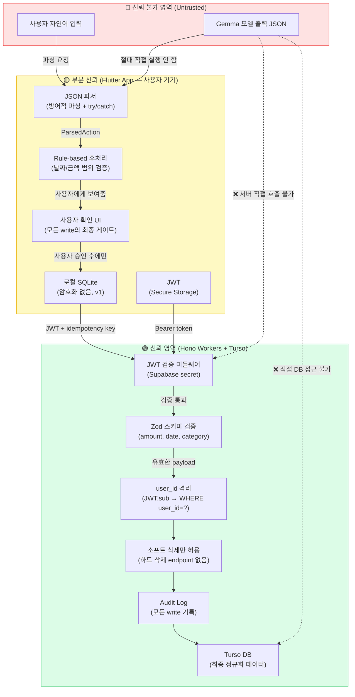

---

## 10. 개발 단계별 로드맵

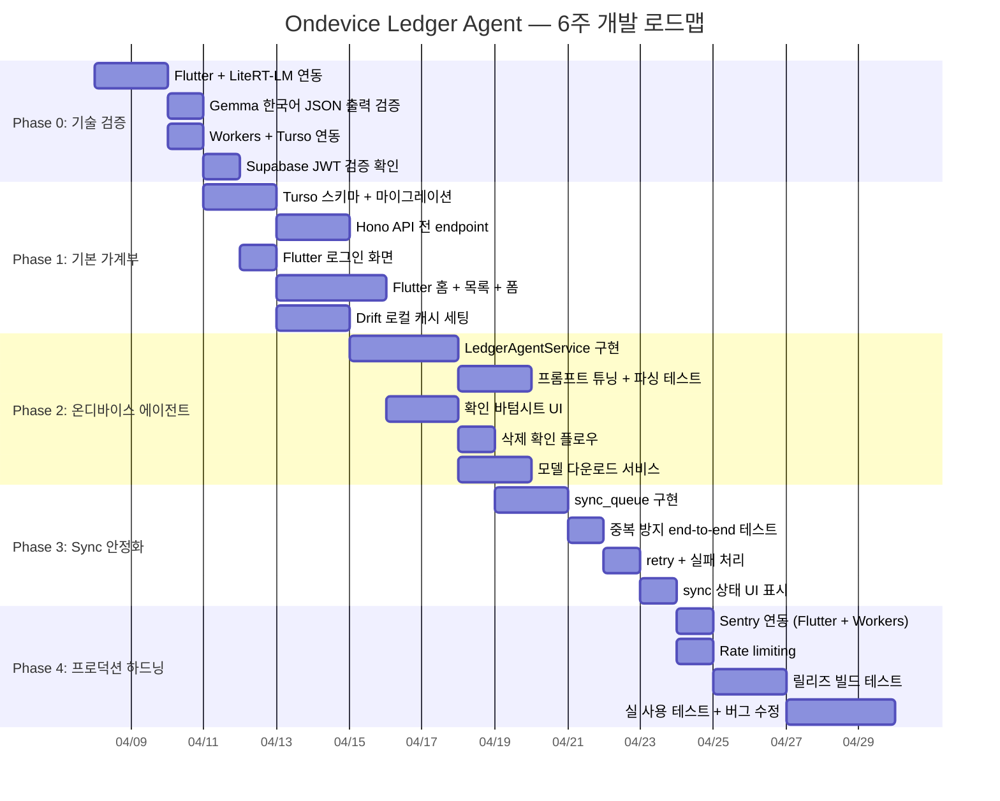

---

## 다이어그램 범례

| 색상 | 의미 |
|------|------|
| 🔵 파란색 | Flutter / UI 레이어 |
| 🟢 초록색 | 온디바이스 AI (Gemma / LiteRT-LM) |
| 🟡 노란색 | API 레이어 (Hono / Workers) |
| 🩷 분홍색 | 데이터 / 인증 레이어 (Turso / Supabase) |
| 🔴 빨간색 | 신뢰 불가 / 위험 영역 |
| 🟢 초록 테두리 | 신뢰 가능 / 안전한 영역 |

> 이 다이어그램들은 [Mermaid](https://mermaid.js.org/)로 작성되어 GitHub에서 자동으로 렌더링됩니다.

---

## 11. 모노레포 전체 파일 트리

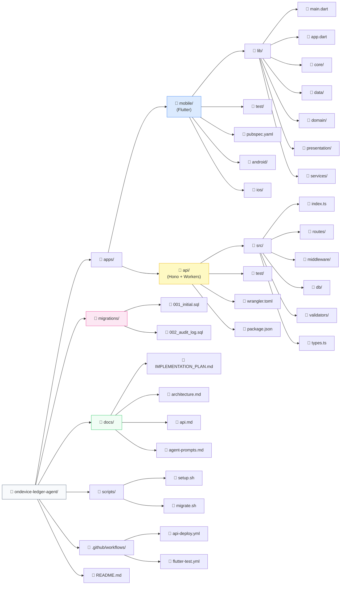

---

## 12. Flutter 파일 의존성 그래프

### 12-1. 진입점 및 라우팅

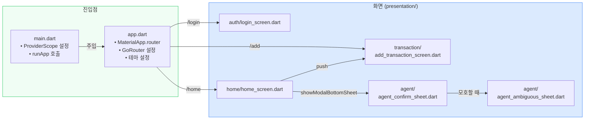

### 12-2. Presentation → Provider → Repository 의존성

```mermaid
graph TD
    subgraph PRES["📁 presentation/"]
        LOGIN_S["auth/login_screen.dart"]
        HOME_S["home/home_screen.dart"]
        NL_BAR["home/widgets/\nnatural_language_input_bar.dart"]
        TX_TILE["home/widgets/\ntransaction_list_tile.dart"]
        SUMMARY["home/widgets/\nmonthly_summary_card.dart"]
        ADD_S["transaction/\nadd_transaction_screen.dart"]
        CAT_SEL["transaction/widgets/\ncategory_selector.dart"]
        CONFIRM_S["agent/agent_confirm_sheet.dart"]
        AMBIG_S["agent/agent_ambiguous_sheet.dart"]
    end

    subgraph PROV["📁 providers (Riverpod)"]
        LOGIN_P["auth/login_provider.dart\nAuthNotifier"]
        HOME_P["home/home_provider.dart\nmonthlyTransactionsProvider\nsummaryProvider"]
        AGENT_P["agent/agent_provider.dart\nAgentNotifier\nidle→processing→confirm→error"]
        ADD_P["transaction/\nadd_transaction_provider.dart"]
        SYNC_P["SyncStatusProvider\n(services/sync_service.dart 구독)"]
    end

    subgraph REPO["📁 data/repositories/"]
        AUTH_REPO["auth_repository.dart\n로그인/로그아웃/세션"]
        TX_REPO["transaction_repository.dart\n로컬 우선 read/write"]
    end

    LOGIN_S --> LOGIN_P
    HOME_S --> HOME_P
    HOME_S --> SYNC_P
    NL_BAR --> AGENT_P
    TX_TILE --> HOME_P
    SUMMARY --> HOME_P
    ADD_S --> ADD_P
    ADD_S --> CAT_SEL
    CONFIRM_S --> AGENT_P
    AMBIG_S --> AGENT_P

    LOGIN_P --> AUTH_REPO
    HOME_P --> TX_REPO
    ADD_P --> TX_REPO
    AGENT_P --> TX_REPO

    style PRES fill:#dbeafe,stroke:#3b82f6
    style PROV fill:#ede9fe,stroke:#8b5cf6
    style REPO fill:#fef9c3,stroke:#eab308
```

### 12-3. Data 레이어 파일 의존성

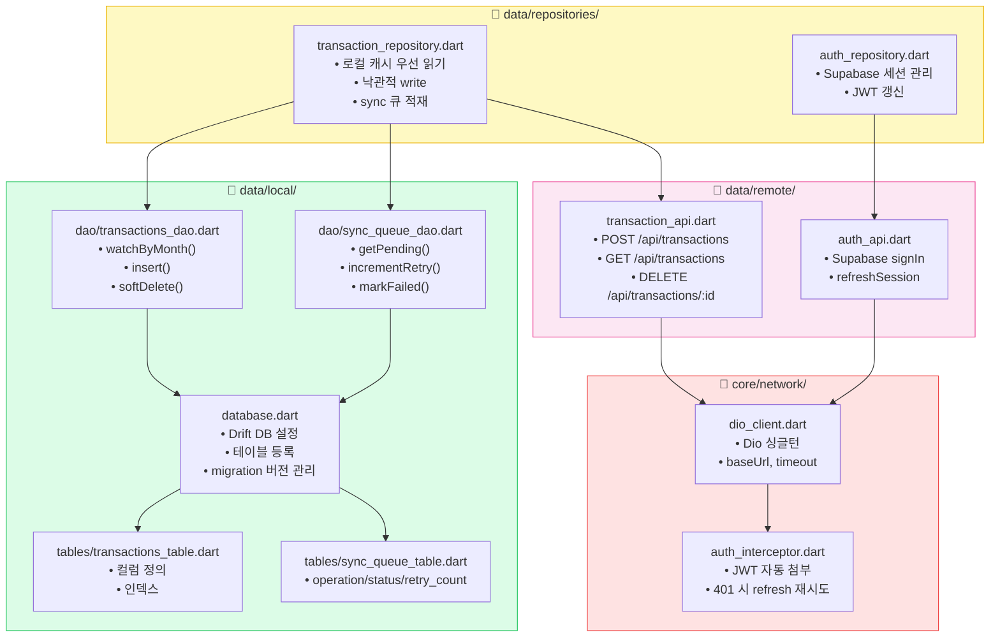

### 12-4. Domain 및 Agent 파일 의존성

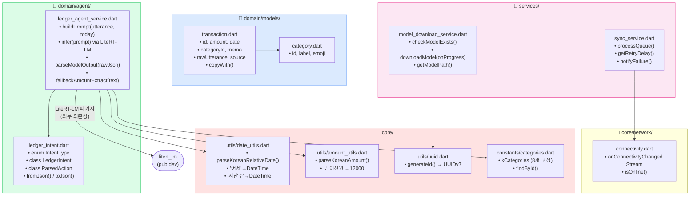

---

## 13. Flutter 파일별 역할 일람

### `main.dart` / `app.dart`

| 파일 | 책임 | 주요 내용 |
|------|------|-----------|
| `main.dart` | 앱 진입점 | `ProviderScope` 감싸기, `runApp` |
| `app.dart` | 앱 설정 | `MaterialApp.router`, `GoRouter` 라우트 정의, 테마 |

### `core/` — 공통 유틸

| 파일 | 책임 | 핵심 함수/클래스 |
|------|------|-----------------|
| `network/dio_client.dart` | Dio 싱글턴 | `dioClientProvider`, baseUrl, timeout 설정 |
| `network/auth_interceptor.dart` | JWT 자동 처리 | `onRequest`: JWT 헤더 첨부, `onError`: 401 시 refresh |
| `network/connectivity.dart` | 네트워크 상태 | `connectivityProvider` (Stream), `isOnline()` |
| `utils/date_utils.dart` | 한국어 날짜 파싱 | `parseKoreanRelativeDate(text, now)` |
| `utils/amount_utils.dart` | 한국어 금액 파싱 | `parseKoreanAmount(raw, utterance)` |
| `utils/uuid.dart` | ID 생성 | `generateId()` → UUIDv7 문자열 |
| `constants/categories.dart` | 고정 카테고리 | `kCategories` 리스트 8개, `findById(id)` |
| `constants/api_endpoints.dart` | API URL | `ApiEndpoints.transactions`, `ApiEndpoints.summary` |
| `errors/app_exception.dart` | 에러 타입 | `AppException`, `NetworkException`, `ParseException` |

### `data/local/` — 로컬 DB (Drift)

| 파일 | 책임 | 핵심 내용 |
|------|------|-----------|
| `database.dart` | Drift DB 설정 | `@DriftDatabase(tables: [...])`, `schemaVersion`, migration |
| `tables/transactions_table.dart` | 거래 테이블 스키마 | 컬럼 정의, `deleted_at` soft delete |
| `tables/sync_queue_table.dart` | sync 큐 스키마 | `operation`, `status`, `retry_count` |
| `dao/transactions_dao.dart` | 거래 쿼리 | `watchByMonth()`, `insert()`, `softDelete()` |
| `dao/sync_queue_dao.dart` | 큐 쿼리 | `getPending()`, `incrementRetry()`, `markFailed()`, `delete()` |

### `data/remote/` — 서버 API 호출

| 파일 | 책임 | 핵심 내용 |
|------|------|-----------|
| `transaction_api.dart` | 거래 API | `createTransaction()`, `fetchTransactions()`, `deleteTransaction()` |
| `auth_api.dart` | 인증 API | Supabase `signIn()`, `signOut()`, `refreshSession()` |

### `data/repositories/` — 로컬+리모트 조율

| 파일 | 책임 | 핵심 내용 |
|------|------|-----------|
| `transaction_repository.dart` | 거래 저장소 | 로컬 우선 읽기, 낙관적 write, sync 큐 적재 |
| `auth_repository.dart` | 인증 상태 | JWT 저장/삭제, 세션 유효성 확인 |

### `domain/` — 비즈니스 로직

| 파일 | 책임 | 핵심 내용 |
|------|------|-----------|
| `models/transaction.dart` | 거래 데이터 클래스 | 불변 클래스, `copyWith()`, `toJson()` / `fromJson()` |
| `models/category.dart` | 카테고리 클래스 | `id`, `label`, `emoji` |
| `agent/ledger_intent.dart` | intent 스키마 | `enum IntentType`, `class ParsedAction` |
| `agent/ledger_agent_service.dart` | Gemma 파싱 | `parse(utterance, now)`, `buildPrompt()`, `parseModelOutput()` |

### `presentation/` — UI 화면

| 파일 | 책임 | 핵심 내용 |
|------|------|-----------|
| `auth/login_screen.dart` | 로그인 화면 | 이메일/비밀번호 입력, Supabase 로그인 버튼 |
| `auth/login_provider.dart` | 로그인 상태 | `AuthNotifier`: loading / authenticated / error |
| `home/home_screen.dart` | 메인 화면 | 월 선택, 거래 목록, 하단 NL 입력바 |
| `home/home_provider.dart` | 홈 상태 | `monthlyTransactionsProvider`, `summaryProvider` |
| `home/widgets/natural_language_input_bar.dart` | NL 입력창 | TextField + 전송 버튼, AgentNotifier 트리거 |
| `home/widgets/transaction_list_tile.dart` | 거래 항목 | 스와이프 삭제, 금액/카테고리/날짜 표시 |
| `home/widgets/monthly_summary_card.dart` | 월별 합계 | 총 지출, 카테고리별 금액 |
| `transaction/add_transaction_screen.dart` | 거래 추가 폼 | 날짜 선택, 금액 입력, 카테고리 선택 |
| `transaction/add_transaction_provider.dart` | 폼 상태 | 폼 필드 상태, submit 로직 |
| `transaction/widgets/category_selector.dart` | 카테고리 선택 | 8개 카테고리 칩 그리드 |
| `agent/agent_confirm_sheet.dart` | 확인 바텀시트 | ParsedAction 미리보기, 확인/수정/취소 버튼 |
| `agent/agent_ambiguous_sheet.dart` | 재질문 UI | 모호한 필드 입력 요청 (카테고리 선택 등) |
| `agent/agent_provider.dart` | 에이전트 상태 | `AgentNotifier`: idle→processing→confirm→error |

### `services/` — 앱 서비스

| 파일 | 책임 | 핵심 내용 |
|------|------|-----------|
| `sync_service.dart` | 오프라인 큐 처리 | `processQueue()`, exponential backoff, 실패 알림 |
| `model_download_service.dart` | Gemma 모델 관리 | `checkModelExists()`, `downloadModel(onProgress)`, 파일 경로 반환 |

---

## 14. Hono API 파일 의존성 그래프

### 14-1. 전체 파일 의존성

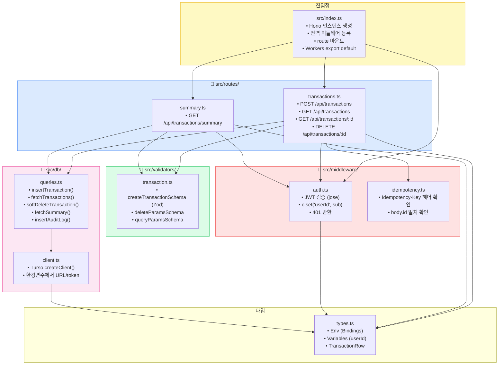

### 14-2. 요청별 파일 실행 경로

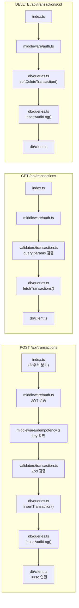

---

## 15. API 파일별 역할 일람

### `src/index.ts`

```
역할: Hono 앱 루트 설정
- Hono 인스턴스 생성
- 전역 CORS / logger 미들웨어
- /api/transactions → transactions 라우터 마운트
- /api/transactions/summary → summary 라우터 마운트
- GET /api/health → 헬스체크 (인증 불필요)
- export default app (Workers 엔트리포인트)
```

### `src/middleware/`

| 파일 | 역할 | 동작 |
|------|------|------|
| `auth.ts` | JWT 검증 | `Authorization: Bearer {jwt}` 파싱 → `jose.jwtVerify()` → `c.set('userId', payload.sub)` → 실패 시 401 |
| `idempotency.ts` | 중복 방지 게이트 | `Idempotency-Key` 헤더 존재 확인 → `body.id === key` 검증 → 불일치 시 400 |

### `src/routes/`

| 파일 | 엔드포인트 | 핵심 로직 |
|------|-----------|-----------|
| `transactions.ts` | `POST /api/transactions` | auth → idempotency → Zod 검증 → `insertTransaction()` → `insertAuditLog()` → 201 또는 200(duplicate) |
| `transactions.ts` | `GET /api/transactions` | auth → query params 검증 → `fetchTransactions(userId, month)` → 200 |
| `transactions.ts` | `DELETE /api/transactions/:id` | auth → `softDeleteTransaction(id, userId)` → `insertAuditLog()` → 200 |
| `summary.ts` | `GET /api/transactions/summary` | auth → `fetchSummary(userId, month)` → 200 |

### `src/validators/transaction.ts`

```
createTransactionSchema (Zod):
  - id: UUID
  - amount: number, positive, max 100_000_000
  - date: string, regex /^\d{4}-\d{2}-\d{2}$/
  - category_id: enum (8개 고정값)
  - memo: string, max 200, optional
  - raw_utterance: string, max 500, optional
  - source: enum ['form', 'agent']

queryParamsSchema:
  - month: string, regex /^\d{4}-\d{2}$/, optional
  - category_id: enum, optional
```

### `src/db/`

| 파일 | 역할 | 핵심 내용 |
|------|------|-----------|
| `client.ts` | Turso 클라이언트 | `createClient({ url: env.TURSO_URL, authToken: env.TURSO_TOKEN })` |
| `queries.ts` | SQL 쿼리 함수 | `insertTransaction()`: `INSERT ... ON CONFLICT(id) DO NOTHING` + rows_affected 확인 |
| `queries.ts` | | `softDeleteTransaction()`: `UPDATE ... SET deleted_at = datetime('now') WHERE id = ? AND user_id = ?` |
| `queries.ts` | | `fetchSummary()`: `GROUP BY category_id` aggregate 쿼리 |
| `queries.ts` | | `insertAuditLog()`: 모든 write 이벤트 기록 |

### `src/types.ts`

```typescript
// Workers 환경변수 바인딩
type Env = {
  TURSO_URL: string
  TURSO_TOKEN: string
  SUPABASE_JWT_SECRET: string
}

// Hono context 변수 (미들웨어가 설정)
type Variables = {
  userId: string
}
```

### `wrangler.toml`

```
역할: Cloudflare Workers 배포 설정
- name: ledger-agent-api
- main: src/index.ts
- compatibility_date
- [vars]: 비민감 환경변수
- secrets (별도 wrangler secret put으로 설정):
    TURSO_URL, TURSO_TOKEN, SUPABASE_JWT_SECRET
```

---

## 16. 마이그레이션 파일 적용 순서

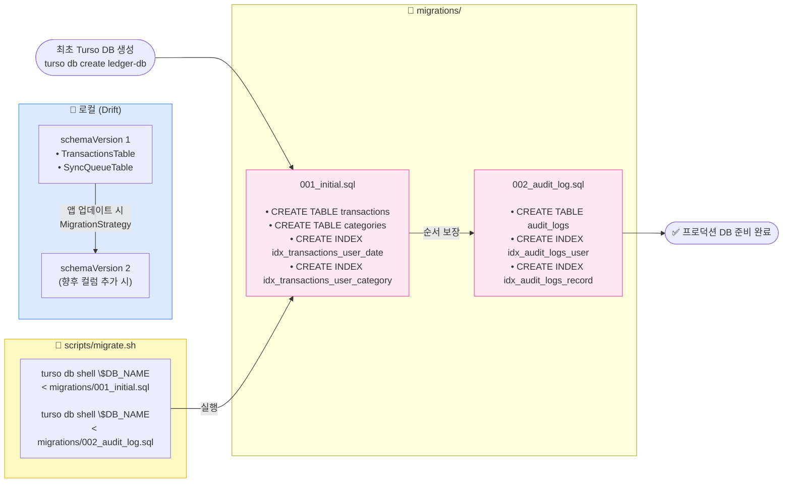

### 마이그레이션 적용 규칙

| 규칙 | 내용 |
|------|------|
| **번호 순서 보장** | 001 → 002 → ... 반드시 순서대로 실행 |
| **멱등성** | 모든 DDL에 `IF NOT EXISTS` 사용 |
| **롤백 없음** | Turso는 DDL rollback 미지원. 문제 시 새 migration으로 fix-forward |
| **Drift 별도 관리** | 서버 Turso 스키마와 Flutter Drift 스키마는 독립적으로 버전 관리 |
| **컬럼 추가만** | v1에서는 컬럼 삭제/이름 변경 금지. 추가만 허용 |
