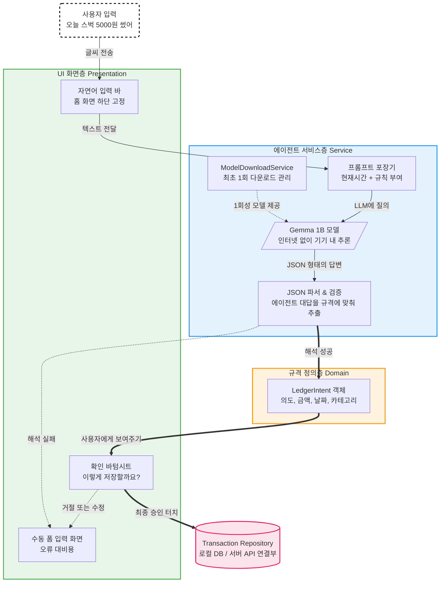
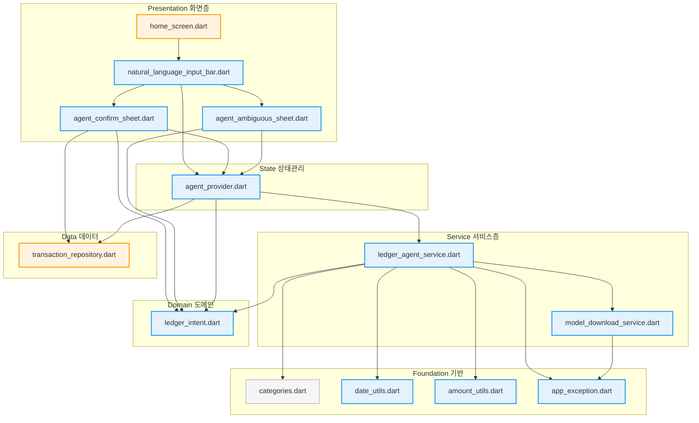
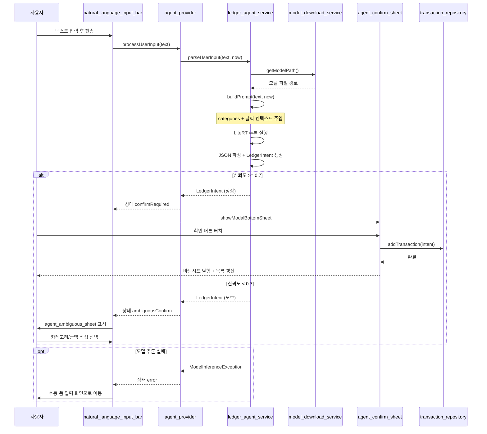

# Step 3: 온디바이스 자연어 에이전트 아키텍처

스마트폰 안에서 인터넷 연결 없이도, **입력부터 분석, 그리고 저장 승인까지 어떻게 흘러가는지**를 시각적으로 정리한 구조도입니다.

---

## 구현 파일 의존성 그래프

화살표 방향: **A → B = A가 B를 import(의존)**

색상 기준:
- 파랑: 신규 생성 파일
- 주황: 기존 파일 수정
- 회색: 기존 파일 그대로 사용

---

## 런타임 호출 흐름

사용자가 텍스트를 입력했을 때 파일들이 어떤 순서로 호출되는지를 나타냅니다.

---

### 💡 구조도 요약 포인트
1. **서버 불개입**: `Gemma 1B 모델`이 폰 안에 다운로드 되고 나면, 사용자의 텍스트를 받을 때 스스로 생각하고 출력합니다. 절대로 클라우드 서버로 데이터를 전송하지 않습니다.
2. **에이전트 보조 역할**: 모델이 해석한 정보(`LedgerIntent 객체`)는 곧바로 저장되는 게 아니라 일차적으로 **확인 바텀시트** 창에 뿌려집니다. 사람이 직접 "승인"을 눌러야만 기존에 만들어둔 안전한 가계부 저장소(`Transaction Repository`)로 들어가 데이터베이스에 기록됩니다.
3. **오류 대비(Fallback)**: 모델이 "어? 무슨 말인지 모르겠어" 하거나 무엇을 샀는지 분류가 모호할 땐, 강제로 데이터를 기록하여 망치지 않고 곧바로 **수동 폼 입력 화면**으로 넘겨버리는 안전장치가 마련되어 있습니다.
